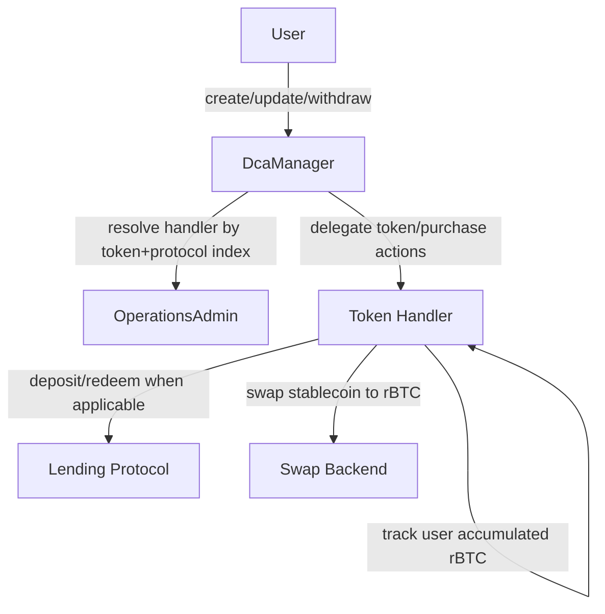

# Architecture Overview

BitChill uses a manager + handler architecture:

- `DcaManager`: user-facing entry point and schedule state
- `OperationsAdmin`: handler registry + roles
- Token handlers: token/lending/swap implementation units

## High-Level Flow

## Contracts and Responsibilities

### DcaManager

- stores schedules: `mapping(user => mapping(token => DcaDetails[]))`
- validates schedule index + schedule ID
- enforces purchase period and purchase amount rules
- delegates stablecoin/rBTC operations to handler resolved from `OperationsAdmin`

### OperationsAdmin

- registry key: `keccak256(token, lendingProtocolIndex)` -> handler address
- role management (`ADMIN_ROLE`, `SWAPPER_ROLE`)
- lending protocol name/index mapping

### Handlers

Concrete handlers combine:

- token custody and transfer logic (`TokenHandler`)
- optional lending integration (`SovrynErc20Handler`; `TropykusErc20Handler` legacy)
- purchase backend (`PurchaseMoc` or `PurchaseUniswap`)
- fee calculation (`FeeHandler`)

## Active Mainnet Handlers

- `SovrynDocHandlerMoc`
- `TropykusDocHandlerMoc` (legacy)
- `TropykusErc20HandlerDex` (USDRIF, legacy)

## Access Model

- Users: manage only own schedules/funds
- `SWAPPER_ROLE`: execute purchases
- `ADMIN_ROLE`: configure handlers/protocol mappings and swapper role
- Owner roles: ownership-level configuration functions in manager/admin/handlers

## Reentrancy Coverage

ReentrancyGuard is applied in DcaManager on critical external state-changing functions (deposits/withdrawals/purchase execution and aggregated withdrawal flows). It is not a blanket modifier on every external function.

## Next Steps

- [Core contracts](/docs/contracts/core-contracts)
- [Integration guide](/docs/contracts/integration)
