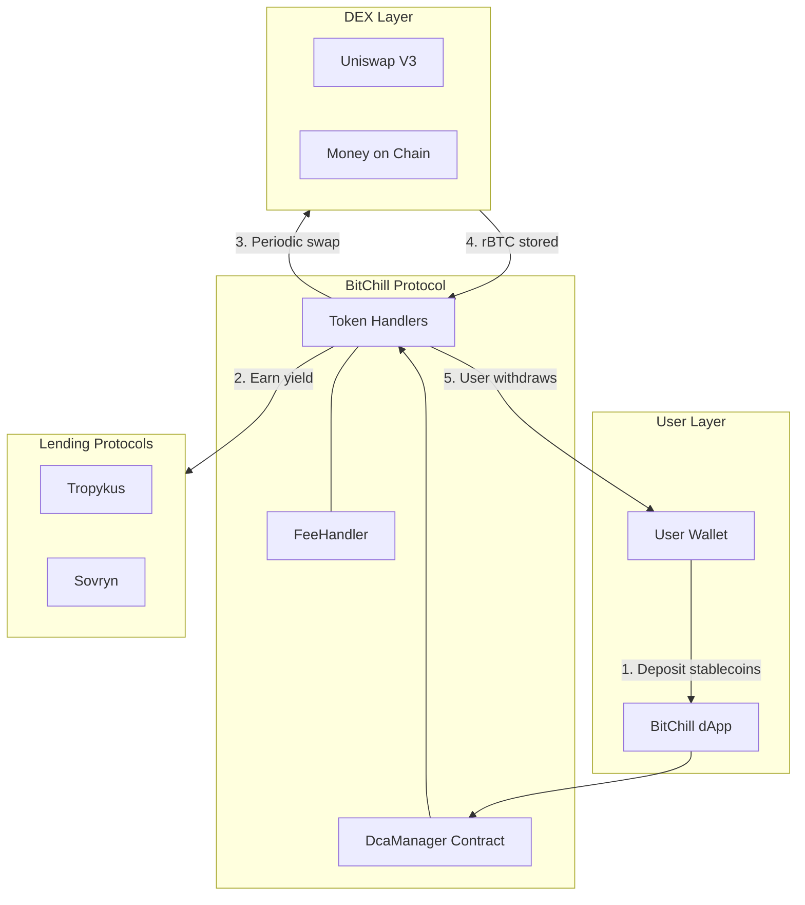
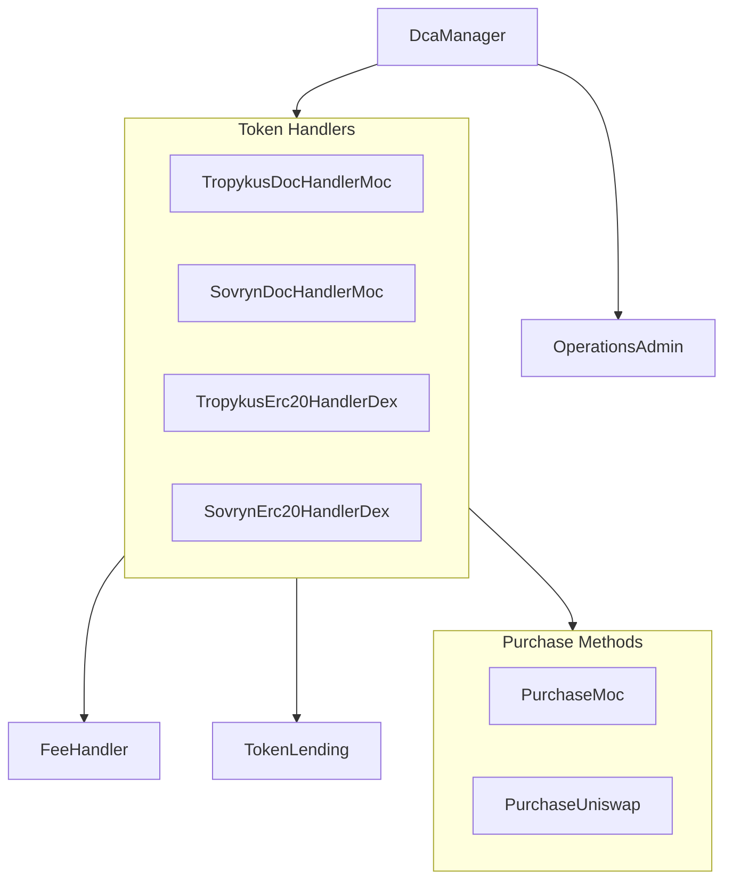
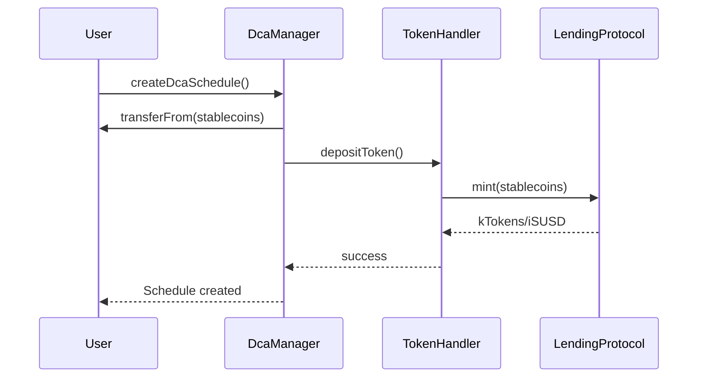
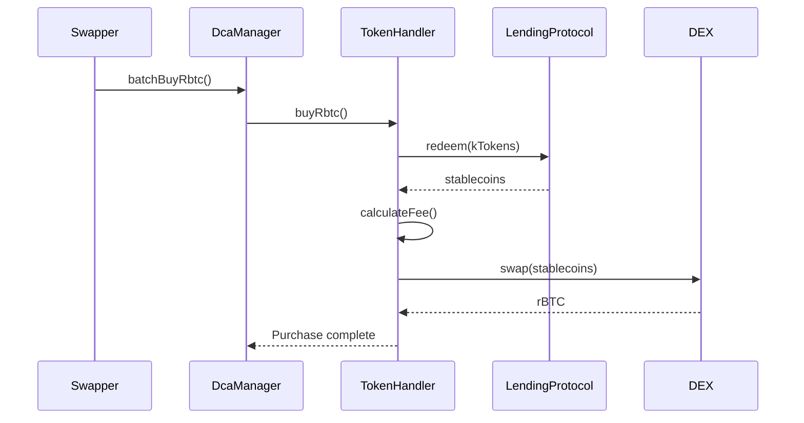
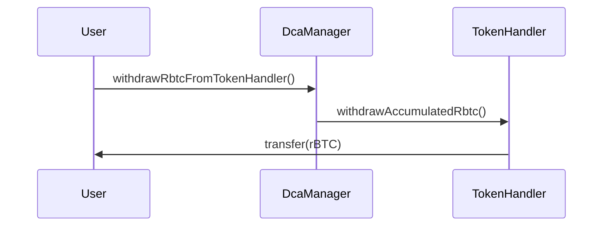

# Architecture Overview

BitChill's smart contract architecture is designed for modularity, security, and extensibility.

## System Diagram



## Contract Hierarchy



## Core Components

### DcaManager

The main entry point for all user interactions. Responsibilities:

- Creating, updating, and deleting DCA schedules
- Managing deposits and withdrawals
- Coordinating with TokenHandlers for operations
- Enforcing schedule limits and validation rules

### OperationsAdmin

Administrative contract managing protocol configuration:

- Token handler registry (maps token + protocol → handler)
- Role management (ADMIN_ROLE, SWAPPER_ROLE)
- Lending protocol registry

### Token Handlers

Specialized contracts for each stablecoin + lending protocol combination:

| Handler | Stablecoin | Lending | Swap Method |
|---------|------------|---------|-------------|
| TropykusDocHandlerMoc | DOC | Tropykus | Money on Chain |
| SovrynDocHandlerMoc | DOC | Sovryn | Money on Chain |
| TropykusErc20HandlerDex | USDRIF | Tropykus | Uniswap V3 |
| SovrynErc20HandlerDex | DOC/USDRIF | Sovryn | Uniswap V3 |

### FeeHandler

Base contract inherited by all handlers, implementing:

- Sliding fee scale calculation
- Fee parameter storage
- Fee collection logic

## Inheritance Structure

```
Ownable (OpenZeppelin)
    └── FeeHandler
        └── TokenHandler
            └── TokenLending (Tropykus/Sovryn)
                └── PurchaseRbtc
                    └── PurchaseMoc / PurchaseUniswap
                        └── Concrete Handler
```

## Data Flow

### Deposit Flow



### Purchase Flow



### Withdrawal Flow



## Security Model

### Access Control

| Role | Permissions |
|------|-------------|
| **Owner** | Deploy, configure protocol parameters |
| **ADMIN_ROLE** | Manage handlers, assign swapper role |
| **SWAPPER_ROLE** | Execute batch purchases |
| **Users** | Manage own schedules only |

### Protection Mechanisms

- **ReentrancyGuard**: All external calls protected
- **Schedule ID Validation**: Prevents index manipulation attacks
- **onlyDcaManager**: TokenHandler functions restricted
- **SafeERC20**: Safe token transfers throughout

## Extensibility

The architecture supports adding:

- **New Stablecoins**: Deploy new TokenHandler
- **New Lending Protocols**: Create new TokenLending implementation
- **New Swap Methods**: Create new Purchase implementation
- **New Chains**: Deploy full contract suite (future)

## Next Steps

- [Explore core contracts in detail](/docs/contracts/core-contracts)
- [View deployed addresses](/docs/contracts/addresses)
