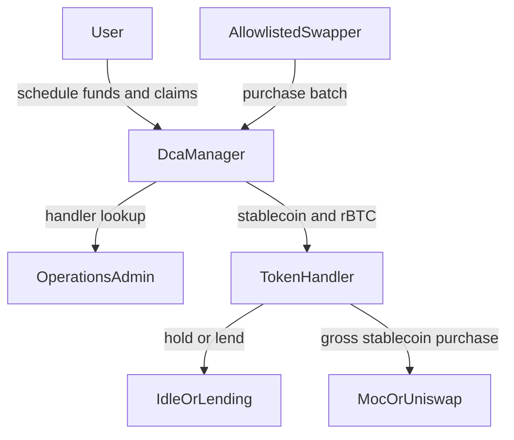

# Architecture

BitChill uses one manager, one registry, and one handler for each stablecoin and route. The contracts are not deployed.

```mermaid
flowchart TB
    User[User]
    Swapper[AllowlistedSwapper]
    Manager[DcaManager]
    Admin[OperationsAdmin]
    Handler[TokenHandler]
    Venue[IdleOrLending]
    Purchase[MocOrUniswap]

    User -->|schedule funds and claims| Manager
    Swapper -->|purchase batch| Manager
    Manager -->|handler lookup| Admin
    Manager -->|stablecoin and rBTC| Handler
    Handler -->|hold or lend| Venue
    Handler -->|gross stablecoin purchase| Purchase
```

## DcaManager

The manager is the user entry and the swapper entry. It stores the schedule ledger. It does not hold the stablecoin, and it does not hold the rBTC.

A schedule is stored under the stablecoin and a decimal schedule id. The value holds the principal, the cadence anchor, the pause flag, the period, the route, the owner, and the purchase amount.

## OperationsAdmin

The registry maps a stablecoin and a route index to one handler. Index 0 is idle. The owner registers other indexes as idle or lending. In the deployment script, index 1 is LayerBank and index 2 is Sovryn.

The owner assigns a handler once for each pair. The owner can pause new deposits for one assigned pair. The owner keeps the swapper allowlist.

## Handlers

A handler custodies the stablecoin for one pair and the rBTC bought for that pair. Users call the manager. The handler accepts those balance changes from the manager.

| Pair | Handler family | Purchase |
| --- | --- | --- |
| DOC idle | Idle DOC handler | Money on Chain |
| DOC LayerBank | LayerBank DOC handler | Money on Chain |
| DOC Sovryn | Sovryn DOC handler | Money on Chain |
| USDRIF idle | Idle DEX handler | Uniswap |
| USDRIF LayerBank | LayerBank DEX handler | Uniswap |
| USDT0 idle | Idle DEX handler | Uniswap |
| USDT0 LayerBank | LayerBank DEX handler | Uniswap |

Tropykus is not a handler route in this protocol. An idle handler does not lend.

## Who can call

| Caller | Allowed work |
| --- | --- |
| Schedule owner | Create, fund, edit, pause purchases, withdraw, delete, and claim for that account |
| Allowlisted swapper | Submit a purchase batch and open the protected purchase window |
| Owner | Set routes, handlers, deposit pauses, swappers, fee parameters, and schedule limits |

## Purchase path

The swapper submits one or more due schedule ids for one stablecoin and one route. The manager reads the buyer and the gross amount from the schedule. The handler spends that gross stablecoin. The fee is a share of the measured rBTC output. The buyer is credited with buyer-net rBTC.

A batch can require a minimum rBTC output. If the measured output is below that minimum, the purchase reverts.

## Read next

- [Core calls](/docs/contracts/core-contracts)
- [Address status](/docs/contracts/addresses)
- [Integration notes](/docs/contracts/integration)
