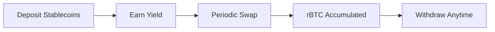

# What is BitChill?

BitChill is a **decentralized Dollar Cost Averaging (DCA) protocol** built on [Rootstock](https://rootstock.io/), the Bitcoin sidechain. It enables users to automatically accumulate Bitcoin (rBTC) by depositing stablecoins and executing periodic purchases.

## Why BitChill?

Dollar Cost Averaging is a proven investment strategy that reduces the impact of volatility by spreading purchases over time. BitChill automates this process on-chain, providing:

- **Automated Purchases**: Set your schedule once, and BitChill handles the rest
- **Yield Generation**: Your stablecoins earn yield in lending protocols while waiting to be swapped
- **Non-Custodial**: You maintain full control of your funds at all times
- **Transparent**: All operations are executed on-chain with verifiable smart contracts
- **Bitcoin-Native**: Built on Rootstock, secured by Bitcoin's hashpower

## How It Works

1. **Deposit**: Deposit DOC or USDRIF stablecoins into a DCA schedule
2. **Earn**: Your stablecoins are deposited into Tropykus or Sovryn lending protocols, earning yield while waiting
3. **Swap**: Based on your chosen period (1, 2, or 4 weeks), a portion of your stablecoins is swapped for rBTC
4. **Accumulate**: Purchased rBTC is stored in your schedule, ready for withdrawal
5. **Withdraw**: Claim your accumulated rBTC whenever you want

## Key Features

| Feature | Description |
|---------|-------------|
| **Flexible Periods** | Choose 1, 2, or 4 week purchase intervals |
| **Multiple Stablecoins** | Support for DOC and USDRIF |
| **Yield Earning** | Integration with Tropykus and Sovryn lending |
| **Low Fees** | Sliding fee scale based on purchase amount |
| **Pull-Based Withdrawals** | Withdraw your rBTC when you're ready |

## Security

BitChill smart contracts have been audited by independent security researchers. All audit reports are publicly available.

[View Audit Reports →](/docs/security/audits)

## Get Started

Ready to start DCA'ing into Bitcoin?

1. [Learn how DCA works](/docs/getting-started/how-dca-works)
2. [See supported tokens and chains](/docs/getting-started/supported-assets)
3. [Connect your wallet and create a schedule](/docs/user-guide/connect-wallet)
