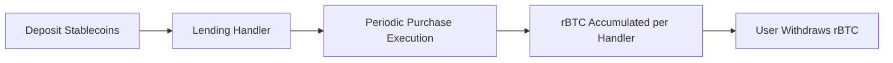

# What is BitChill?

BitChill is a **decentralized Dollar Cost Averaging (DCA) protocol** on [Rootstock](https://rootstock.io/). It lets users automate periodic Bitcoin accumulation by depositing stablecoins and executing scheduled purchases of rBTC.

## Why BitChill?

- **Automated DCA**: Configure a schedule once, then purchases are executed on your behalf by the protocol swapper role
- **Yield Integration**: Deposited stablecoins can be routed through supported lending handlers
- **Non-custodial user flows**: Users manage their own schedules and withdrawals directly from smart contracts
- **Transparent execution**: Schedules, purchases, and balances are verifiable on-chain
- **Bitcoin ecosystem alignment**: Built on Rootstock

## How It Works

1. **Create schedule**: Choose token, deposit amount, purchase amount, purchase period, and lending protocol index.
2. **Deposit handling**: The configured token handler receives funds and, when applicable, routes them into the lending integration.
3. **Periodic execution**: Authorized swapper calls `buyRbtc` / `batchBuyRbtc` when schedules are due.
4. **rBTC accounting**: Purchased rBTC is tracked per user **per token handler** (token + lending protocol pair).
5. **Withdrawals**: Users withdraw accumulated rBTC from a specific handler or across multiple handlers.

## Important Notes

- The app currently offers **1, 2, and 4 week** presets, while the contract enforces a configurable minimum period.
- Purchase amount must satisfy contract validation (minimum configured by owner, and `purchaseAmount <= balance / 2`).
- Interest is tracked separately from schedule balance and can be withdrawn via dedicated interest withdrawal functions.

## Security

BitChill contracts are open source and audited. See:

- [Audit Reports](/docs/security/audits)
- [Security Model](/docs/security/security-model)

## Get Started

1. [Learn how DCA works](/docs/getting-started/how-dca-works)
2. [See supported assets](/docs/getting-started/supported-assets)
3. [Create your first schedule](/docs/user-guide/create-schedule)
