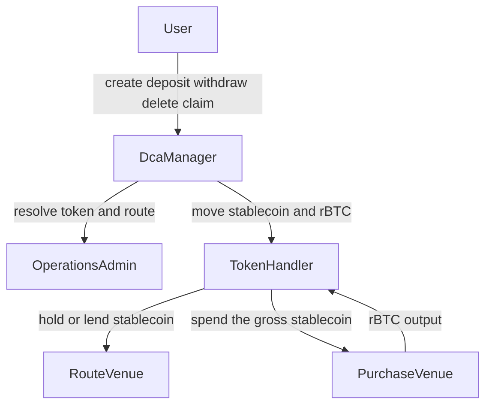

# What is BitChill?

BitChill is a dollar-cost averaging protocol on [Rootstock](https://rootstock.io/). You deposit a stablecoin on a schedule. An allowlisted swapper can buy rBTC for that schedule. rBTC is the native asset of Rootstock.

The protocol contracts in these pages are not deployed. No manual audit of this version is published. An audit is planned. The protocol is not deployed before that audit.

## What a schedule does

- You choose one stablecoin and one route.
- You set a purchase amount and a cadence. The cadence is a whole number of UTC days.
- You spend the gross stablecoin amount on each purchase. The purchase fee is taken in rBTC from the swap output. You receive the buyer-net rBTC.
- A lending route can lend the stablecoin that is still waiting. The idle route earns no lending yield.
- You withdraw, delete, and claim rBTC with your own transaction. Website data never blocks that exit.

## How a purchase moves

```mermaid
flowchart TB
    User[User]
    Manager[DcaManager]
    Admin[OperationsAdmin]
    Handler[TokenHandler]
    Venue[RouteVenue]
    Purchase[PurchaseVenue]

    User -->|create deposit withdraw delete claim| Manager
    Manager -->|resolve token and route| Admin
    Manager -->|move stablecoin and rBTC| Handler
    Handler -->|hold or lend stablecoin| Venue
    Handler -->|spend the gross stablecoin| Purchase
    Purchase -->|rBTC output| Handler
```

1. You create a schedule. You name the stablecoin, the deposit, the purchase amount, the cadence, and the route.
2. The handler holds the stablecoin. A lending handler can lend it. An idle handler does not lend it.
3. The first purchase is eligible on the creation UTC day once the swapper submits it. A later purchase becomes eligible at 00:00 UTC on the due day. The purchase spends the full gross stablecoin amount. The fee is a share of the measured rBTC output.
4. The handler stores your buyer-net rBTC until you claim it. That balance is per user, per stablecoin, and per route. It is not stored on each schedule.
5. You can withdraw principal, delete the schedule, or claim rBTC. A delete returns principal. A delete does not claim interest. A delete does not claim rBTC.

A purchase has no guaranteed minute. A missed cadence slot is skipped. There is no catch-up. A purchase also needs the swapper, enough balance, and a schedule that is not purchase-paused. A deposit pause does not by itself stop a purchase. The purchase also needs liquidity, a passing price check, and a successful transaction.

## Routes in this protocol

| Stablecoin | Decimals | Routes |
| --- | --- | --- |
| DOC | 18 | Idle, LayerBank, Sovryn |
| USDRIF | 18 | Idle, LayerBank |
| USDT0 | 6 | Idle, LayerBank |

Tropykus is not a route in this protocol.

## Security status

The 2025 Ivan Fitro reports cover earlier contract versions. Those reports are not a manual audit of this version. No manual audit of this version is published.

[Read the audit status](/docs/security/audits)

## Read next

1. [How a schedule runs](/docs/getting-started/how-dca-works)
2. [Stablecoins and routes](/docs/getting-started/supported-assets)
3. [Prepare a Rootstock wallet](/docs/user-guide/connect-wallet)
