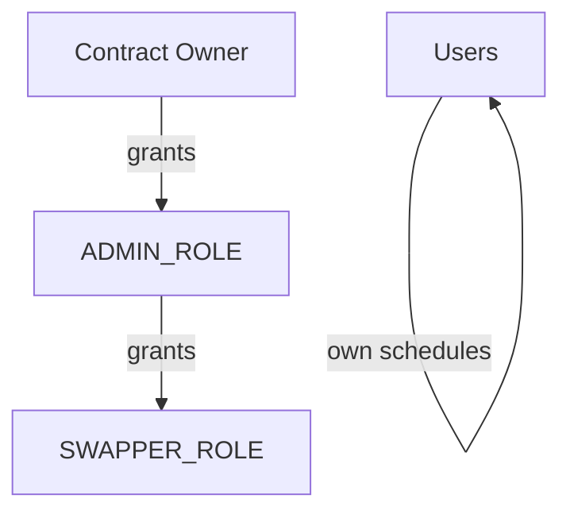

# Security Model

BitChill implements multiple layers of security to protect user funds and ensure protocol integrity.

## Design Principles

### Non-Custodial

Users maintain control of their funds at all times:

- Funds are held in smart contracts, not by any centralized entity
- Only users can withdraw their own funds
- No admin can access or move user deposits

### Pull-Based Withdrawals

BitChill uses a pull pattern for rBTC distribution:

```
❌ Push: Contract sends rBTC to user after each purchase
✅ Pull: User withdraws accumulated rBTC when ready
```

**Benefits**:
- No failed transfers to contracts that can't receive rBTC
- User controls gas timing
- Simpler purchase execution (no transfer complexity)
- Accumulated rBTC is always safe in the handler

### Minimal Trust Surface

Users only need to trust:

1. BitChill smart contracts (audited, open source)
2. Underlying protocols (Tropykus, Sovryn, Uniswap, MoC)
3. Rootstock network consensus

No trust required in:
- BitChill team (can't access funds)
- Centralized servers (only for convenience, not custody)
- Any single individual

## Access Control

### Role Hierarchy



### Owner Capabilities

The contract owner can:
- Set the OperationsAdmin contract
- Modify protocol parameters (min purchase, max schedules)
- Grant ADMIN_ROLE
- Rescue stuck funds (edge cases only)

The owner **cannot**:
- Access user deposits
- Modify user schedules
- Withdraw user rBTC
- Change fees retroactively

### Admin Capabilities

ADMIN_ROLE holders can:
- Grant/revoke SWAPPER_ROLE
- Add/update token handlers
- Register new lending protocols

Admins **cannot**:
- Access user funds
- Execute purchases
- Modify user data

### Swapper Capabilities

SWAPPER_ROLE is granted to an automated wallet that:
- Executes `batchBuyRbtc()` when periods elapse
- Cannot modify schedules or parameters
- Cannot withdraw any funds

The swapper is a single-purpose automation account.

### User Capabilities

Users can only interact with their own schedules:
- Create/update/delete their schedules
- Deposit/withdraw their stablecoins
- Withdraw their accumulated rBTC

## Smart Contract Security

### Reentrancy Protection

All functions with external calls use OpenZeppelin's `ReentrancyGuard`:

```solidity
function withdrawRbtcFromTokenHandler(...) external nonReentrant {
    // External calls protected
}
```

### Schedule ID Validation

Each schedule has a unique ID preventing index manipulation:

```solidity
bytes32 scheduleId = keccak256(abi.encodePacked(
    msg.sender,
    token,
    userNonce++
));
```

Operations require both index AND matching ID, preventing:
- Index swap attacks
- Cross-user schedule access
- Replay attacks

### Input Validation

All inputs are validated:

| Parameter | Validation |
|-----------|------------|
| Purchase amount | At least minimum, at most 50% of balance |
| Purchase period | At least minimum period |
| Schedule count | At most max per token |
| Deposit amount | Greater than 0 |

### Safe Token Transfers

All ERC20 operations use OpenZeppelin's SafeERC20:

```solidity
using SafeERC20 for IERC20;
token.safeTransferFrom(user, address(this), amount);
```

This handles tokens that don't return booleans correctly.

### Checks-Effects-Interactions

State changes occur before external calls:

```solidity
// 1. Check
require(balance >= amount, "Insufficient");

// 2. Effect (state change)
balances[user] -= amount;

// 3. Interaction (external call)
token.safeTransfer(user, amount);
```

## Oracle Security

### Uniswap V3 Integration

When swapping via Uniswap V3:

1. **Price validation**: Current price checked against MoC oracle
2. **Staleness check**: Oracle data must be fresh
3. **Slippage protection**: Maximum acceptable slippage enforced

```solidity
function _validatePrice(uint256 oraclePrice, uint256 spotPrice) internal view {
    uint256 deviation = calculateDeviation(oraclePrice, spotPrice);
    require(deviation <= maxSlippage, "Price deviation too high");
}
```

### Money on Chain Integration

MoC swaps use primary market pricing:
- No slippage (direct redemption)
- Price determined by MoC protocol
- More predictable execution

## External Dependency Risks

### Lending Protocol Risk

User funds are deposited into:
- **Tropykus**: Compound-fork on Rootstock
- **Sovryn**: Native RSK lending protocol

Risks include:
- Smart contract bugs in lending protocols
- Economic attacks on lending pools
- Extreme market conditions affecting liquidity

**Mitigations**:
- Both protocols are established with track records
- Users choose which protocol to use
- No single dependency

### DEX Risk

Swaps occur through:
- **Money on Chain**: Primary market redemption
- **Uniswap V3**: AMM pools

Risks include:
- Low liquidity causing slippage
- Oracle manipulation

**Mitigations**:
- Oracle price validation
- Slippage limits enforced
- MoC offers slippage-free alternative for DOC

## Operational Security

### Swapper Wallet

The automated swapper wallet:
- Holds minimal rBTC for gas
- Has only SWAPPER_ROLE (no admin powers)
- Is monitored for unusual activity
- Can be rotated if compromised

### Multi-Sig Considerations

Protocol parameters can be protected by multi-sig (governance upgrade path).

## Known Limitations

### Not Protected Against

| Risk | Status |
|------|--------|
| Rootstock network failure | Dependent on RSK |
| Complete lending protocol insolvency | User accepts protocol risk |
| Extreme gas price spikes | Purchases may delay |
| Smart contract upgrade bugs | Contracts are immutable |

### Immutable Contracts

Core contracts are **not upgradeable** by design:
- No proxy patterns
- No admin upgrade functions
- Logic cannot be changed post-deployment

This provides security guarantees but means bugs require migration, not patches.

## Incident Response

In case of security incidents:

1. **Pause if possible**: Some operations can be paused
2. **Assess impact**: Determine affected users/funds
3. **Communicate**: Transparent disclosure
4. **Remediate**: Deploy fixes or migration path
5. **Post-mortem**: Public analysis of what went wrong

## Continuous Security

### Monitoring

- On-chain event monitoring
- Anomaly detection for unusual patterns
- Transaction tracking

### Future Audits

As the protocol evolves:
- New features will be audited
- Periodic re-audits planned
- Bug bounty program consideration

## Security Resources

- [Audit Reports](/docs/security/audits)
- [Source Code](https://github.com/BitChillRSK/dca-contracts)
- [Verified Contracts](https://rootstock.blockscout.com)
