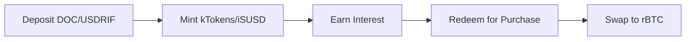

# Earning Yield

One of BitChill's key advantages is that your stablecoins earn yield while waiting to be swapped for rBTC.

## How Yield Earning Works

When you create a DCA schedule, your stablecoins don't sit idle:



1. **Deposit**: Your stablecoins are sent to the TokenHandler
2. **Mint**: The handler deposits them into the lending protocol and receives yield-bearing tokens
3. **Earn**: Interest accrues continuously as the lending pool generates returns
4. **Redeem**: When a purchase executes, only the needed amount is redeemed
5. **Compound**: Remaining balance continues earning

## Lending Protocol Integration

### Tropykus

[Tropykus](https://tropykus.com/) is a Compound-fork lending protocol.

**How it works**:
- Your stablecoins are converted to kTokens (kDOC or kUSDRIF)
- kTokens appreciate in value over time
- Exchange rate = (underlying + interest) / kToken supply

**Example**:
```
Deposit: 1000 DOC
Receive: 1000 kDOC (at 1:1 initial rate)
After 1 month: 1000 kDOC = 1002 DOC (0.2% monthly yield)
```

### Sovryn

[Sovryn](https://sovryn.com/) offers lending pools for DOC.

**How it works**:
- Your DOC is deposited into the lending pool
- You receive iSUSD tokens representing your share
- Interest accrues from borrower payments

**Example**:
```
Deposit: 1000 DOC
Share: Proportional pool ownership
After 1 month: Pool grows, your share = 1003 DOC (0.3% monthly yield)
```

## Yield Rates

Yield rates are variable and depend on:

- **Utilization**: Higher borrowing demand = higher rates
- **Market conditions**: DeFi activity on Rootstock
- **Protocol parameters**: Each protocol sets base rates

:::info Current Rates
Check current APY rates directly on:
- [Tropykus App](https://tropykus.com/)
- [Sovryn App](https://sovryn.com/)
:::

## Yield on DCA Purchases

Your yield is automatically factored into purchases:

1. BitChill redeems from the lending protocol
2. The redemption includes accrued interest
3. More stablecoins = slightly more rBTC per purchase

**Example**:
```
Scheduled purchase: 100 DOC worth
Interest accrued: 0.2 DOC
Actual swap: 100.2 DOC → slightly more rBTC
```

## Withdrawing Interest

You can withdraw accrued interest separately from your DCA schedule:

1. Navigate to your schedule
2. Click **"Withdraw Interest"**
3. Specify amount or withdraw all
4. Confirm the transaction

Interest is withdrawn in the underlying stablecoin (DOC or USDRIF).

## Yield vs. Schedule Balance

| Metric | Description |
|--------|-------------|
| **Deposited** | Original stablecoins you deposited |
| **Current Balance** | Deposited + accrued interest |
| **Interest** | Current balance - deposited (your earnings) |

## Protocol Comparison

| Aspect | Tropykus | Sovryn |
|--------|----------|--------|
| Stablecoins | DOC, USDRIF | DOC |
| Token Type | kTokens | iSUSD |
| Yield Mechanism | Exchange rate appreciation | Pool share value |
| Typical APY | Variable | Variable |

## Risks

### Smart Contract Risk

Lending protocols have their own smart contract risks. While Tropykus and Sovryn have been audited, no protocol is risk-free.

### Interest Rate Risk

Variable rates mean yields can decrease if:
- Borrowing demand drops
- Large deposits dilute the pool
- Protocol parameters change

### Liquidity Risk

In extreme scenarios, lending protocols might have withdrawal delays if utilization is very high.

## Next Steps

- [Understand BitChill's fee structure](/docs/user-guide/fees)
- [Review security measures](/docs/security/security-model)
