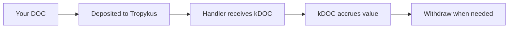

# Earning Yield

One of BitChill's key features is that your stablecoins earn yield while waiting to be swapped. This page explains how yield generation works.

## How It Works

When you deposit stablecoins into a BitChill schedule:

1. Your stablecoins are routed by the selected handler into a lending protocol (Tropykus or Sovryn)
2. The handler receives lending tokens (kDOC, kUSDRIF, or iSUSD) and tracks your share internally
3. The lending position accrues value over time as borrowers pay interest
4. When purchases occur, the required stablecoin amount is redeemed from lending
5. Your remaining position continues earning yield



## Yield Accounting

BitChill tracks your yield through the lending token mechanism:

| Protocol | Lending Token | How Interest Works |
|----------|--------------|-------------------|
| Tropykus | kDOC, kUSDRIF | Exchange rate increases over time |
| Sovryn | iSUSD | Asset balance grows via interest |

### Tropykus (Compound-style)

The handler tracks your position as a kToken balance (`s_kTokenBalances[user]`). The underlying stablecoin value grows as the exchange rate increases:

```
Underlying stablecoin value = tracked kToken balance × exchange rate
```

As `exchangeRate` increases, your underlying value grows.

### Sovryn

The handler tracks your position in iSUSD (`s_iSusdBalances[user]`). As Sovryn yield accrues, the redeemable stablecoin value of that position increases.

## Principal vs Interest

BitChill maintains a clear separation:

| Type | What It Is | How to Withdraw |
|------|-----------|-----------------|
| **Principal** | Your original deposit minus purchases | `withdrawToken` or delete schedule |
| **Interest** | Yield earned on your balance | `withdrawAllAccumulatedInterest` |

:::warning Important
Regular withdrawals and schedule deletions do **not** automatically include interest!
:::

## Checking Your Interest

### Via the App

The BitChill dashboard shows your accrued interest per token + lending protocol combination.

### Via Contract

```solidity
getInterestAccrued(user, token, lendingProtocolIndex)
```

This returns the interest amount for a specific user and handler.

## Withdrawing Interest

### Option 1: Interest Only

Withdraw just the accrued interest while keeping your schedules active:

```solidity
withdrawAllAccumulatedInterest(tokens[], lendingProtocolIndexes[])
```

### Option 2: Combined Withdrawal

Withdraw both principal and interest in one transaction:

```solidity
withdrawTokenAndInterest(token, scheduleIndex, scheduleId, withdrawalAmount, lendingProtocolIndex)
```

## Interest and Purchases

**Important clarification**: Scheduled purchases only use your `purchaseAmount`, not your accrued interest.

For example, if you have:
- Schedule balance: 1000 DOC
- Accrued interest: 50 DOC
- Purchase amount: 100 DOC

Each purchase swaps exactly 100 DOC for rBTC. The 50 DOC interest remains untouched and continues earning yield.

## Expected Yields

Yield rates are variable and depend on lending protocol utilization and market conditions.

Check live rates on:
- **Tropykus**: [tropykus.com](https://tropykus.com/)
- **Sovryn**: [sovryn.app](https://sovryn.app/)

## Risks

Yield generation involves inherent risks:

- **Smart contract risk**: Lending protocol contracts could have vulnerabilities
- **Liquidity risk**: During high demand, withdrawals might be delayed
- **Interest rate risk**: APY can fluctuate significantly
- **Protocol risk**: Lending protocol governance or technical issues

BitChill only integrates with established Rootstock lending protocols, but users should understand these risks.

## Example Scenario

Illustrative example only (not a forecast or guarantee):

- Initial deposit: `1000 DOC`
- Purchase amount: `100 DOC` weekly
- Assumed fee: `1%` flat (so `99 DOC` net swapped each week)
- Assumed lending APY: `8%` (kept constant for illustration)
- Assumed swap price: `1 BTC = 100,000 DOC` (kept constant for illustration)

Under those fixed assumptions:

| Week | Principal | Interest | Purchased rBTC |
|------|-----------|----------|----------------|
| 0 | 1000 DOC | 0 DOC | 0 BTC |
| 1 | 900 DOC | ~1.5 DOC | ~0.00099 BTC |
| 2 | 800 DOC | ~2.9 DOC | ~0.00198 BTC |
| 4 | 600 DOC | ~5.2 DOC | ~0.00396 BTC |
| 10 | 0 DOC | ~8.5 DOC | ~0.00990 BTC |

Real outcomes will differ based on live lending rates, fee settings, swap execution price, slippage, and timing.

## Next Steps

- [Understanding fees](/docs/user-guide/fees)
- [Security model](/docs/security/security-model)
- [FAQ](/docs/resources/faq)
