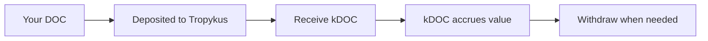

# Earning Yield

One of BitChill's key features is that your stablecoins earn yield while waiting to be swapped. This page explains how yield generation works.

## How It Works

When you deposit stablecoins into a BitChill schedule:

1. Your stablecoins are deposited into a lending protocol (Tropykus or Sovryn)
2. You receive lending tokens (kDOC, kUSDRIF, or iSUSD) representing your deposit
3. These lending tokens accrue value over time as borrowers pay interest
4. When purchases occur, the required amount is withdrawn from lending
5. Your remaining balance continues earning yield



## Yield Accounting

BitChill tracks your yield through the lending token mechanism:

| Protocol | Lending Token | How Interest Works |
|----------|--------------|-------------------|
| Tropykus | kDOC, kUSDRIF | Exchange rate increases over time |
| Sovryn | iSUSD | Asset balance grows via interest |

### Tropykus (Compound-style)

Your kToken balance stays constant, but the exchange rate to the underlying stablecoin increases:

```
Your DOC = kToken balance × exchangeRate
```

As `exchangeRate` increases, your underlying DOC value grows.

### Sovryn

Sovryn tracks your balance directly. Your `assetBalanceOf` increases as interest accrues.

## Principal vs Interest

BitChill maintains a clear separation:

| Type | What It Is | How to Withdraw |
|------|-----------|-----------------|
| **Principal** | Your original deposit minus purchases | `withdrawToken` or delete schedule |
| **Interest** | Yield earned on your balance | `withdrawAllAccumulatedInterest` |

:::warning Important
Regular withdrawals and schedule deletions do **not** automatically include interest!
:::

## Checking Your Interest

### Via the App

The BitChill dashboard shows your accrued interest per token + lending protocol combination.

### Via Contract

```solidity
getInterestAccrued(user, token, lendingProtocolIndex)
```

This returns the interest amount for a specific user and handler.

## Withdrawing Interest

### Option 1: Interest Only

Withdraw just the accrued interest while keeping your schedules active:

```solidity
withdrawAllAccumulatedInterest(tokens[], lendingProtocolIndexes[])
```

### Option 2: Combined Withdrawal

Withdraw both principal and interest in one transaction:

```solidity
withdrawTokenAndInterest(token, lendingProtocolIndex, scheduleIndex, scheduleId, amount)
```

## Interest and Purchases

**Important clarification**: Scheduled purchases only use your `purchaseAmount`, not your accrued interest.

For example, if you have:
- Schedule balance: 1000 DOC
- Accrued interest: 50 DOC
- Purchase amount: 100 DOC

Each purchase swaps exactly 100 DOC for rBTC. The 50 DOC interest remains untouched and continues earning yield.

## Expected Yields

Yield rates depend on:
- Lending protocol utilization rates
- Market conditions
- Supply and demand for borrowing

Check current APYs:
- **Tropykus**: [tropykus.com](https://tropykus.com/)
- **Sovryn**: [sovryn.app](https://sovryn.app/)

Typical ranges: 2-10% APY depending on market conditions.

## Risks

Yield generation involves inherent risks:

- **Smart contract risk**: Lending protocol contracts could have vulnerabilities
- **Liquidity risk**: During high demand, withdrawals might be delayed
- **Interest rate risk**: APY can fluctuate significantly
- **Protocol risk**: Lending protocol governance or technical issues

BitChill only integrates with established Rootstock lending protocols, but users should understand these risks.

## Example Scenario

You deposit 1000 DOC with 100 DOC weekly purchases:

| Week | Principal | Interest | Purchased rBTC |
|------|-----------|----------|----------------|
| 0 | 1000 DOC | 0 DOC | 0 |
| 1 | 900 DOC | ~1.5 DOC | ~0.001 BTC |
| 2 | 800 DOC | ~2.8 DOC | ~0.002 BTC |
| 4 | 600 DOC | ~4.5 DOC | ~0.004 BTC |
| 10 | 0 DOC | ~5.0 DOC | ~0.01 BTC |

After all purchases complete, you still have ~5 DOC in interest to withdraw!

## Next Steps

- [Understanding fees](/docs/user-guide/fees)
- [Security model](/docs/security/security-model)
- [FAQ](/docs/resources/faq)
